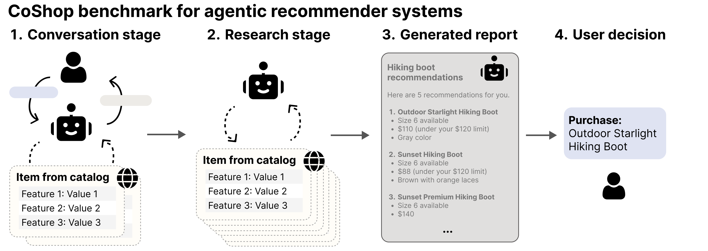

# Beyond expert users: agents should help users construct preferences, not just elicit them

*An interactive benchmark for agentic recommender systems that must help non-expert users
**construct** their preferences — not just elicit them — before making a recommendation.*

[](https://arxiv.org/abs/2606.30863)
[](https://irenasaracay.github.io/coshop/)
[](https://irenasaracay.github.io/coshop/api)



Each CoShop task pairs a simulated CoPref user (anchored to a real human from the source
dataset) with a held-out target item `x*`. A rollout proceeds in four stages:

1. **Conversation** — the agent converses with the user for up to 5 turns (or
   until it ends the conversation early). Alongside messages it can call a catalog search
   tool that returns the most relevant items in featurized form. Budgeted to 50 retrievals,
   20 clarifying questions, and 10 unique items shown.
2. **Research** — the agent searches the catalog more thoroughly, with an expanded budget
   of 250 retrievals.
3. **Report** — the agent writes up its final `k = 5` recommendations.
4. **Selection** — the user picks one item from the report, evaluating it against their
   final preference state.

The `coshop` Python package provides everything needed to build and evaluate agents:
dataset loading, simulated CoPref users, retrieval tools, and metrics with
budget tracking. The repository also bundles a reference evaluation harness
(`evaluate_agent.py`), self-contained launcher scripts (`example_experiment_launchers/`),
and a set of `example_agents` you can run or extend.

## Installation

CoShop requires **Python ≥ 3.10**.

```bash
git clone https://github.com/irenasaracay/coshop
cd coshop
pip install -e .
```

The dataset assets (catalogs, transactions, and H&M images) are
downloaded automatically on the first `get_dataset(...)` call
for a given dataset, then cached in the installed package directory.

### API keys

CoShop's simulated users and the example agents call hosted LLMs. Set the relevant key(s)
before running:

```bash
export ANTHROPIC_API_KEY=...   # for Claude models
export OPENAI_API_KEY=...      # for OpenAI models
```

To point any
component at a self-hosted (vLLM) model, pass `--policy_vllm_url` / `--simulator_vllm_url`
(see [How to use](#how-to-use)).

## Data

CoShop covers three product domains, sourced from datasets of real human–product
interactions. 

| Dataset | Domain | `name` | Source |
|---------|--------|--------|--------|
| H&M | Fashion / e-commerce | `hm` | [link](https://www.kaggle.com/competitions/h-and-m-personalized-fashion-recommendations) |
| MovieLens | Movie recommendation | `movielens` | [link](https://grouplens.org/datasets/movielens/) |
| Goodreads | Book recommendation | `goodreads` | [link](https://cseweb.ucsd.edu/~jmcauley/datasets/goodreads.html) |

Each dataset provides a product catalog with domain-specific feature columns. We enriched
the original columns using a mix of regex and LLM-based methods to grow the feature set.

|  | **H&M** | **MovieLens** | **Goodreads** |
|---|---:|---:|---:|
| Number of test users | 100 | 100 | 100 |
| Catalog size `\|X\|` | 37,570 | 26,637 | 39,050 |
| Number of domain features `\|F\|` | 77 | 92 | 102 |
| Initial state size `\|S₁\|` | 3.92 (6.05) | 1.67 (1.20) | 3.76 (11.08) |
| Max state size `\|F(x*)\|` | 36.69 (9.07) | 87.59 (2.14) | 88.24 (8.20) |
| Search features `\|Fₛ\|` | 6.11 (6.84) | 8.60 (16.74) | 7.76 (11.92) |
| Experience features `\|Fₑ\|` | 21.47 (7.33) | 70.20 (12.72) | 66.98 (65.22) |
| Credence features `\|F_c\|` | 9.11 (7.42) | 8.79 (2.35) | 13.50 (70.79) |

Numbers reported as mean (standard deviation) across the 100 test users.

**Test users.** Each of the 100 users per domain is anchored to a real human from the
source dataset; their target item `x*` is the last item that user purchased or rated ≥ 4/5.
Each user's **SEC split is personalized** from their purchase history: for each feature, we
compare the user's empirical selection frequency against the catalog marginal via pointwise
mutual information. Features the user consistently over-selects become **search** features;
features selected at roughly the catalog rate become **experience**; and rare or
under-selected features become **credence**. Each user's initial state `S₁` is a subset of
their search features, constructed to be exactly one feature short of identifying `x*` —
challenging, but not adversarial.

Load a dataset directly:

```python
from coshop.data import get_dataset

dataset = get_dataset("hm")          # canonical order: "hm", "movielens", "goodreads"
print(len(dataset))                  # number of benchmark tasks (specifications)
spec = dataset[0]                    # a single task
print(spec.item_name)                # e.g. "garment"
```

Each `Specification` describes one task: the user's latent preferences (and SEC split), the
candidate catalog, and the ground-truth utility used for scoring.

## How to use

The most common use case is **evaluating your own model** against the standard CoShop
agent harness. The reference RAG baseline is the **`copref_aware_llm`** policy — a
SEC-aware agent that converses in natural language, calls a vector-search retrieval tool,
and writes a final report. You can drop in any OpenAI-compatible model endpoint as the
policy and run it through the exact same harness used for the paper's results.

### Optional: set up vector search

BM25 retrieval (`--retrieval_type BM25`) works with no extra setup. The standard benchmark
uses dense **vector search**, which proxies to an embedding endpoint. Launch the server:

```bash
EMBEDDING_API_URL=http://localhost:8000 ./launch_vector_search_server.sh
export VECTOR_SEARCH_API_URL=http://localhost:3004
```

(`coshop-vector-search-server` is also installed as a console script.)

`EMBEDDING_API_URL` may point at **any OpenAI-compatible embeddings endpoint**:

- `/v1` is appended automatically if the URL does not already end in it.
- `EMBEDDING_MODEL` (default `text-embedding-api`) is the model id sent to the endpoint;
  set it to match the name the backend serves the model under (e.g. vLLM's
  `--served-model-name`, or `text-embedding-3-small` for OpenAI).
- Authentication uses the standard `openai` client (`OPENAI_API_KEY`); set a dummy value
  for local servers that don't check it.

For example, to serve an embedding model with vLLM on another host:

```bash
# on the embedding host
vllm serve Qwen/Qwen3-Embedding-0.6B --served-model-name qwen3-embed --port 8000

# wherever you run CoShop
EMBEDDING_API_URL=http://embed-host:8000 EMBEDDING_MODEL=qwen3-embed \
  ./launch_vector_search_server.sh
export VECTOR_SEARCH_API_URL=http://localhost:3004
```

Or against OpenAI's hosted embeddings:

```bash
OPENAI_API_KEY=sk-... EMBEDDING_API_URL=https://api.openai.com \
  EMBEDDING_MODEL=text-embedding-3-small ./launch_vector_search_server.sh
```

### Evaluate a model served at `localhost:3002`

`evaluate_agent.py`'s defaults already reproduce the standard RAG condition (the
`copref_aware_llm` policy, a CoPref/SEC user, vector-search retrieval, and the paper's
budgets). So to evaluate a new model you only need to point the **policy** at it — every
other knob stays at its default.

Suppose your model is served behind an OpenAI-compatible API at `http://localhost:3002`
(e.g. `vllm serve my-org/my-model --served-model-name my-model --port 3002`). First start
the vector-search server the baseline retrieves with (see [Vector search](#vector-search)):

```bash
EMBEDDING_API_URL=http://localhost:8000 ./launch_vector_search_server.sh
export VECTOR_SEARCH_API_URL=http://localhost:3004
```

Then run, overriding only the policy lines:

```bash
python evaluate_agent.py \
    --dataset hm \
    --output_dir results/hm/my_model \
    --policy_model my-model \
    --policy_vllm_url http://localhost:3002/v1
```

That's it — `--policy_model` / `--policy_vllm_url` are the only lines that change to swap in
a different model. To evaluate all three domains, repeat with `--dataset movielens` and
`--dataset goodreads`. Results, per-task transcripts, and metrics are written under
`--output_dir`.

> The CoPref user simulator is what makes a task a *CoPref* task; it defaults to
> `claude-haiku-4-5`. Keep it on a strong, fixed model while varying the policy, or point it
> at your own endpoint with `--simulator_model` / `--simulator_vllm_url`.

### Use the bundled launchers

`example_experiment_launchers/` contains self-contained scripts that reproduce the paper's
main evaluation conditions, each tied to a specific section/figure:

| Launcher | Condition | Paper |
|----------|-----------|-------|
| `launch_standard_rag_agent.sh` | Standard RAG agent vs. CoPref (SEC) users — the headline benchmark | §5.2 "Team accuracy reveals human-facing failures" (Table 2, RAG Agents) |
| `launch_search_features_only.sh` | All features made search features (`F_s = F`) — preferences are merely retrieved | §5.1 "Agents excel at search but fail to resolve underspecification" (Figure 4A, *search features only*) |
| `launch_fully_specified.sh` | Full preference set `φ(x*)` revealed upfront, no elicitation — execution-only ceiling | §5.1 (Figure 4A, *fully-specified*) |
| `launch_history_agent.sh` | Policy additionally sees the user's prior rating history — knowledge intervention | §5.3 "Interventions on agent knowledge and communication" (Table 2, history access; Figure 4C) |
| `launch_override_item_descs.sh` | Agent item descriptions overridden to mention all features — communication intervention | §5.3 "Interventions on agent knowledge and communication" (Table 2, override item descriptions; Figure 4C) |
| `launch_structured_agent.sh` | Policy emits structured dialog actions instead of free-form text | Appendix "structured dialog actions" |

Each sweeps all three datasets and spells out its full config inline. To evaluate your own
endpoint, edit the model block at the top of a launcher:

```bash
POLICY_MODEL="my-model"
POLICY_VLLM_URL="http://localhost:3002/v1"
```

then run it. See [example_experiment_launchers/README.md](example_experiment_launchers/README.md).

### Key harness options

Run `python evaluate_agent.py --help` for the full list.

- `--dataset` — `hm`, `movielens`, or `goodreads`
- `--policy` — `copref_aware_llm` (the RAG baseline), `copref_aware_history_llm`,
  `raw_llm`, `random_baseline`, `popularity_baseline`
- `--policy_model` / `--policy_vllm_url` — policy model name and (optional) vLLM endpoint
- `--simulator` — `copref_user` (the CoPref/SEC user), `expert_user`, or `full_spec_user`
- `--simulator_model` / `--simulator_vllm_url` — simulator model name and endpoint
- `--retrieval_type` — `VectorSearch` (standard) or `BM25` (no server required)
- `--budget_turns` / `--budget_questions` / `--budget_unique_items` /
  `--elicitation_global_max` — elicitation-phase budgets
- `--execution_global_max` — research-phase retrieval budget
- `--k` — number of items in the final report
- `--spec_indices` — which tasks to run (omit for the full split)

### Writing your own agent

To go beyond the bundled policies, subclass the policy base in
[example_agents/policy.py](example_agents/policy.py) and register it in
[example_agents/__init__.py](example_agents/__init__.py) so it's selectable via `--policy`.
The bundled `copref_aware_llm` ([example_agents/conversational.py](example_agents/conversational.py))
is the canonical reference for how a policy consumes the conversation, calls the retrieval
tool, and emits its report. `evaluate_agent.py` then handles the user simulator, budgets,
and metrics for you.


## Package layout

| Subpackage | Description |
|------------|-------------|
| `coshop.data` | Dataset loading, item representation, and ground-truth scoring |
| `coshop.evaluation` | NDCG/accuracy metrics and per-turn budget tracking |
| `coshop.tools` | LangChain-compatible catalog-retrieval and history-search tools |
| `coshop.user_simulator` | CoPref users that construct preferences from agent actions |
| `coshop.utils` | Shared data types, agent base classes, and model helpers |

## Citation

If you use CoShop in your research, please cite:

```bibtex
@misc{saracay2026beyond,
      title={Beyond expert users: agents should help users construct preferences, not just elicit them}, 
      author={Irena Saracay and Ludwig Schmidt and Carlos Guestrin},
      year={2026},
      eprint={2606.30863},
      archivePrefix={arXiv},
      primaryClass={cs.AI},
}
```
</content>
